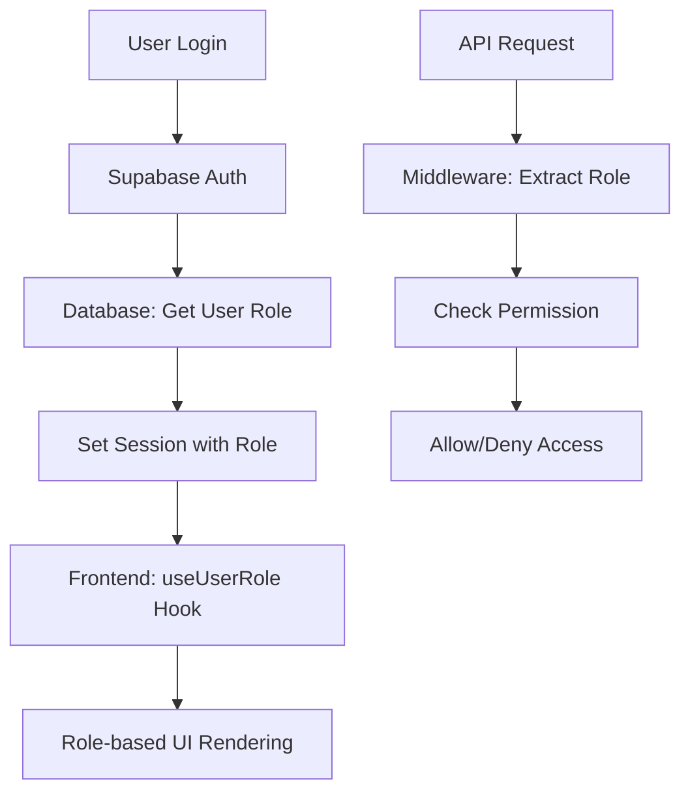

# Sistem Role dan Permission Management

## Gambaran Umum

Sistem ini mengimplementasikan manajemen peran (role) dan izin (permission) yang komprehensif untuk aplikasi EMS. Sistem ini terdiri dari:

1. **3 Role Utama**:
   - `ADMIN`: Akses penuh ke seluruh sistem
   - `MANAGER`: Akses manajemen karyawan dalam departemennya
   - `EMPLOYEE`: Akses terbatas untuk presensi dan data pribadi

2. **Proteksi Multi-Layer**:
   - Database level (model dan migration)
   - API level (middleware dan helper)
   - Frontend level (component dan route protection)

## Struktur File

```
src/
├── hooks/
│   └── useUserRole.ts              # Hook untuk mendapatkan role user
├── lib/
│   ├── menu-config.ts              # Konfigurasi menu berdasarkan role
│   ├── icon-map.ts                 # Mapping icon untuk menu
│   └── auth/
│       └── api-helpers.ts          # Helper untuk proteksi API
├── components/
│   ├── auth/
│   │   └── RoleProtection.tsx      # Komponen proteksi role
│   └── dashboard/
│       └── AppSidebar.tsx          # Sidebar dengan filtering role
├── middleware/
│   └── role-protection.ts          # Middleware proteksi route
└── examples/
    └── role-permission-examples.tsx # Contoh penggunaan
```

## 1. Konfigurasi Database

### Schema Prisma
```prisma
enum Role {
  ADMIN
  MANAGER  
  EMPLOYEE
}

model User {
  id        String    @id @default(cuid())
  name      String?
  email     String?   @unique
  role      Role      @default(EMPLOYEE)
  // ... fields lain
}
```

### Migration
```sql
-- Untuk menambah role jika belum ada
ALTER TABLE "User" ADD COLUMN "role" TEXT NOT NULL DEFAULT 'EMPLOYEE';
```

## 2. Backend Implementation

### API Protection Helper

```typescript
// src/lib/auth/api-helpers.ts
import { requireRole, requireAuth, ApiResponse } from '@/lib/auth/api-helpers';

// Endpoint khusus admin
export const GET = requireRole('ADMIN')(async (request, user) => {
  const data = await prisma.someModel.findMany();
  return ApiResponse.success(data);
});

// Endpoint untuk admin dan manager
export const POST = requireRole(['ADMIN', 'MANAGER'])(async (request, user) => {
  // Logic create data
  return ApiResponse.success(newData);
});

// Endpoint untuk semua user terautentikasi
export const PUT = requireAuth(async (request, user) => {
  // Logic update data
  return ApiResponse.success(updatedData);
});
```

### Middleware Protection
```typescript
// src/middleware/role-protection.ts
export async function roleProtectionMiddleware(request: NextRequest) {
  // Cek role dan redirect jika tidak memiliki akses
}
```

## 3. Frontend Implementation

### Hook Usage
```typescript
import { useUserRole } from '@/hooks/useUserRole';

const { user, role, isAdmin, isManager, canManageEmployees } = useUserRole();
```

### Component Protection

#### Method 1: HOC (Higher-Order Component)
```typescript
import { withRoleProtection } from '@/components/auth/RoleProtection';

const AdminPage = () => <div>Admin only content</div>;

export default withRoleProtection(AdminPage, {
  allowedRoles: 'ADMIN',
  fallbackUrl: '/dashboard'
});
```

#### Method 2: Wrapper Component
```typescript
import { RoleProtection } from '@/components/auth/RoleProtection';

export default function ConfigPage() {
  return (
    <RoleProtection allowedRoles={['ADMIN', 'MANAGER']}>
      <div>Configuration content</div>
    </RoleProtection>
  );
}
```

#### Method 3: Conditional Rendering
```typescript
const Dashboard = () => {
  const { isAdmin, canManageEmployees } = useUserRole();
  
  return (
    <div>
      <h1>Dashboard</h1>
      
      {canManageEmployees() && (
        <button>Manage Employees</button>
      )}
      
      {isAdmin() && (
        <button>System Settings</button>
      )}
    </div>
  );
};
```

## 4. Menu Configuration

### Konfigurasi Menu (src/lib/menu-config.ts)
```typescript
export const MENU_CONFIGURATION: MenuSection[] = [
  {
    title: 'Platform',
    items: [
      {
        title: 'Dashboard',
        url: '/dashboard',
        icon: 'LayoutDashboard',
        roles: ['ADMIN', 'MANAGER', 'EMPLOYEE'], // Semua bisa akses
      },
      {
        title: 'Karyawan',
        url: '/employee',
        icon: 'Users', 
        roles: ['ADMIN', 'MANAGER'], // Hanya admin dan manager
      },
      {
        title: 'Absensi',
        url: '/attendance',
        icon: 'Clock',
        roles: ['ADMIN', 'MANAGER', 'EMPLOYEE'], // Semua bisa akses
      }
    ]
  },
  {
    title: 'Configuration',
    items: [
      {
        title: 'Departemen',
        url: '/configuration/departments',
        icon: 'Building2',
        roles: ['ADMIN'], // Hanya admin
      }
    ]
  }
];
```

## 5. Role Mapping

| Feature | ADMIN | MANAGER | EMPLOYEE |
|---------|-------|---------|-----------|
| Dashboard | ✅ | ✅ | ✅ |
| Lihat semua karyawan | ✅ | ✅ (departemennya) | ❌ |
| Edit karyawan | ✅ | ✅ (departemennya) | ❌ |
| Presensi | ✅ | ✅ | ✅ |
| Approve izin/cuti | ✅ | ✅ (departemennya) | ❌ |
| Konfigurasi sistem | ✅ | ❌ | ❌ |
| Laporan | ✅ | ✅ (departemennya) | ❌ |

## 6. Flow Autentikasi dan Otorisasi



## 7. Security Best Practices

### ✅ DO:
- Selalu validasi role di backend sebelum memberikan akses
- Gunakan enum untuk role consistency
- Implement least privilege principle
- Log access attempts untuk audit
- Gunakan middleware untuk centralized protection

### ❌ DON'T:
- Jangan hanya mengandalkan frontend protection
- Jangan hardcode role checks di multiple places
- Jangan expose sensitive data in API responses
- Jangan skip authorization checks di API routes

## 8. Testing

### Unit Tests
```typescript
// Test role helper functions
describe('Role Helpers', () => {
  test('isAdmin returns true for admin user', () => {
    const adminUser = { role: 'ADMIN' } as AuthenticatedUser;
    expect(isAdmin(adminUser)).toBe(true);
  });
  
  test('canManageEmployees returns true for admin and manager', () => {
    const managerUser = { role: 'MANAGER' } as AuthenticatedUser;
    expect(canManageEmployees(managerUser)).toBe(true);
  });
});
```

### Integration Tests
```typescript
// Test API protection
describe('Protected API Routes', () => {
  test('GET /api/employees requires admin role', async () => {
    const response = await request(app)
      .get('/api/employees')
      .set('x-user-role', 'EMPLOYEE');
    
    expect(response.status).toBe(403);
  });
});
```

## 9. Deployment Checklist

- [ ] Database migration untuk role field
- [ ] Environment variables untuk JWT secrets
- [ ] Middleware configuration di next.config.js
- [ ] CORS settings untuk API routes
- [ ] Test all role combinations
- [ ] Monitor logs untuk unauthorized access attempts

## 10. Troubleshooting

### Common Issues:

1. **"User role not found"**
   - Check database migration
   - Verify user record has role field
   - Check useUserRole hook implementation

2. **"Infinite redirect loop"**
   - Check fallback URL in protection components
   - Verify middleware configuration
   - Check role validation logic

3. **"Menu not showing"**
   - Verify menu-config.ts role mapping
   - Check icon-map.ts for missing icons
   - Debug getAccessibleMenus function

4. **"API returning 401/403"**
   - Check JWT token in request headers
   - Verify API helper middleware setup
   - Check user role in database

Sistem ini memberikan keamanan berlapis dan fleksibilitas dalam mengelola akses berdasarkan peran pengguna.
